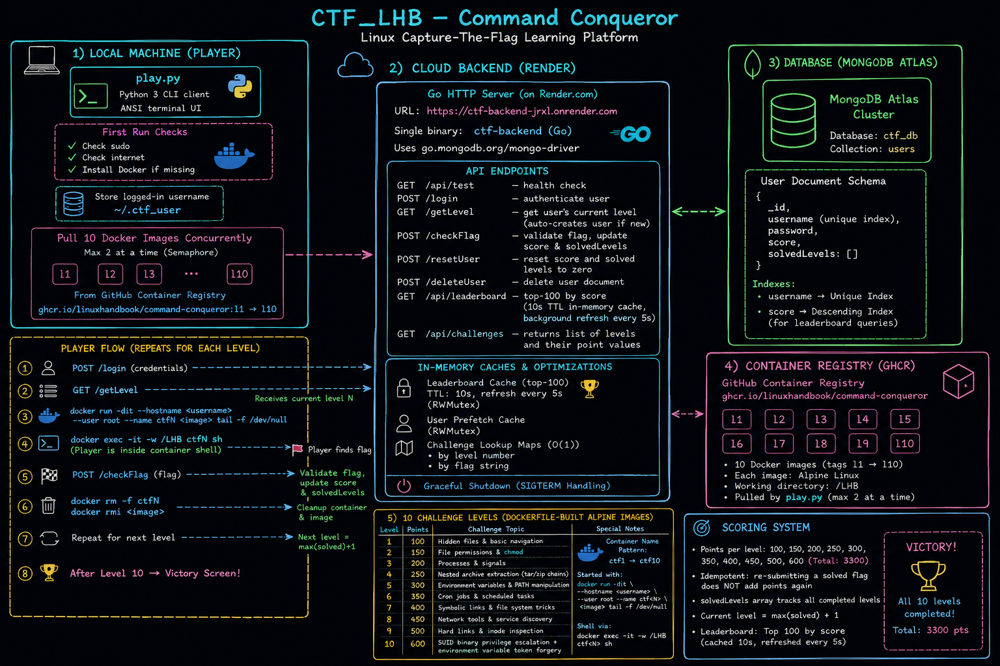

# 🟣 CTF\_LHB — Command Conqueror

<div align="center">

```text
 ▗▄▄▖ ▗▄▖ ▗▖  ▗▖▗▖  ▗▖ ▗▄▖ ▗▖  ▗▖▗▄▄▄      ▗▄▄▖ ▗▄▖ ▗▖  ▗▖▗▄▄▄▖ ▗▖ ▗▖▗▄▄▄▖▗▄▄▖  ▗▄▖ ▗▄▄▖
▐▌   ▐▌ ▐▌▐▛▚▞▜▌▐▛▚▞▜▌▐▌ ▐▌▐▛▚▖▐▌▐▌  █    ▐▌   ▐▌ ▐▌▐▛▚▖▐▌▐▌ ▐▌ ▐▌ ▐▌▐▌   ▐▌ ▐▌▐▌ ▐▌▐▌ ▐▌
▐▌   ▐▌ ▐▌▐▌  ▐▌▐▌  ▐▌▐▛▀▜▌▐▌ ▝▜▌▐▌  █    ▐▌   ▐▌ ▐▌▐▌ ▝▜▌▐▌ ▐▌ ▐▌ ▐▌▐▛▀▀▘▐▛▀▚▖▐▌ ▐▌▐▛▀▚▖
▝▚▄▄▖▝▚▄▞▘▐▌  ▐▌▐▌  ▐▌▐▌ ▐▌▐▌  ▐▌▐▙▄▄▀    ▝▚▄▄▖▝▚▄▞▘▐▌  ▐▌▐▙▄▟▙▖▝▚▄▞▘▐▙▄▄▖▐▌ ▐▌▝▚▄▞▘▐▌ ▐▌
```

**A terminal-native Linux Capture The Flag platform — powered by Linux Handbook**

[](https://go.dev)
[](https://python.org)
[](https://mongodb.com)
[](https://docker.com)
[](https://ghcr.io)

</div>

---

## 📖 What is CTF\_LHB?

**Command Conqueror** is a terminal-first Capture The Flag (CTF) platform built by Linux Handbook. Players sharpen real Linux skills — file permissions, processes, archives, environment variables, cron, symlinks, networking, hard links, and privilege escalation — by solving 10 progressive challenges, each running in an isolated Docker container.

There is **no browser**, no GUI, no hand-holding. Just you, a terminal, and a Linux system to conquer.

---

## 🏗️ Architecture



The platform is split into four layers:

| Layer | Technology | Role |
|---|---|---|
| **CLI Client** | Python 3, `play.py` | Orchestrates Docker containers & talks to the backend |
| **Cloud Backend** | Go 1.20, single binary on Render.com | Flag validation, scoring, leaderboard |
| **Database** | MongoDB Atlas (`ctf_db.users`) | Persistent user state |
| **Container Registry** | GitHub Container Registry (GHCR) | Hosts the 10 challenge Docker images |

### How the layers talk to each other

```
Player Terminal
    │
    │  (1) POST /login → credentials
    │  (2) GET  /getLevel → current level N
    ▼
Go Backend (Render.com)  ←──→  MongoDB Atlas
    │                            (users collection)
    │  validate flags
    │  update score / solvedLevels
    │  serve leaderboard (cached, 10s TTL)
    ▼
play.py manages Docker locally
    │
    │  docker pull  ghcr.io/linuxhandbook/command-conqueror:l<N>
    │  docker run   --name ctf<N> --hostname <username> --user root
    │  docker exec  -it -w /LHB ctf<N> sh   ← player shell
    │  docker rm -f + docker rmi             ← cleanup after solve
    ▼
Challenge Container (Alpine Linux, /LHB working dir)
```

---

## ⚙️ Backend API Reference

The backend is a single Go binary listening on port `10000` (or `$PORT`).

| Method | Endpoint | Description |
|--------|----------|-------------|
| `GET` | `/api/test` | Health check |
| `POST` | `/login` | Authenticate user |
| `GET` | `/getLevel?userId=<id>` | Get user's current level (auto-creates new users) |
| `POST` | `/checkFlag` | Validate flag, update score & `solvedLevels` |
| `POST` | `/resetUser` | Reset score and solved levels to zero |
| `POST` | `/deleteUser` | Delete user document |
| `GET` | `/api/leaderboard` | Top-100 by score (10s TTL cache, 5s background refresh) |
| `GET` | `/api/challenges` | List all levels and their point values |

### Performance internals
- **O(1) challenge lookups** — challenges are indexed in hash maps by level number and by flag string at startup.
- **User prefetch cache** — after each action, the next user read is served from an in-memory `RWMutex`-guarded cache.
- **Leaderboard cache** — top-100 is cached with a 10-second TTL and refreshed in the background every 5 seconds.
- **Atomic flag submission** — a MongoDB `$ne` filter prevents duplicate score awards if the same flag is re-submitted.
- **Graceful shutdown** — `SIGTERM` / `SIGINT` stops accepting requests, cancels background goroutines, then disconnects from MongoDB cleanly.

---

## 🎮 How to Play

### Prerequisites
- Linux or macOS machine
- Python 3.7+
- Docker (running)
- Internet access (to pull images and reach the backend)
- An authorised account (credentials provided by the CTF organiser)

### First-time setup

```bash
git clone https://github.com/linuxhandbook/command-conqueror-CTF-frontend.git
cd command-conqueror-CTF-frontend
sudo python3 play.py
```

On the very first run `play.py` will:
1. Verify you are running as `root` / with `sudo`
2. Check internet connectivity
3. Install Docker if it is missing (Ubuntu/Debian/Fedora/CentOS)
4. Pull **all 10 challenge images concurrently** (max 2 at a time via a semaphore) from GHCR

After setup, the tool remembers your session in `~/.ctf_user` — subsequent runs skip setup and go straight to login.

### Resetting your session

```bash
sudo python3 play.py -r
```

This removes `~/.ctf_user` so the next run will re-authenticate.

---

## 🕹️ In-Game Commands

Once you are logged in and inside a level prompt (`[CTF:L01]▶`):

| Command | What it does |
|---------|--------------|
| `play` | Launch an interactive shell **inside** the Docker container (type `exit` to return) |
| `submit LHB{...}` | Submit a flag for the current level |
| `leaderboard` | Show the top-10 players live from the backend |
| `restart` | Destroy and re-create the current level container (fresh start on this level) |
| `help` | Re-print the command reference panel |

> **Tip:** After typing `play` you land in `/LHB` inside the container. Everything you need to solve the level is somewhere in that environment.

---

## 🗂️ Challenge Levels

All challenges run on **Alpine Linux** with `/LHB` as the working directory. Each level teaches a distinct Linux concept.

| # | Points | Topic | Core skill |
|--:|:------:|-------|------------|
| 1 | 100 | Hidden files & basic navigation | `ls -la`, dotfiles |
| 2 | 150 | File permissions & `chmod` | read/write/execute bits |
| 3 | 200 | Processes & signals | `ps`, `kill`, background jobs |
| 4 | 250 | Nested archive extraction | `tar`, `unzip`, chained archives |
| 5 | 300 | Environment variables & PATH | `export`, `$PATH` tricks |
| 6 | 350 | Cron jobs & scheduled tasks | `crontab`, `/etc/cron*` |
| 7 | 400 | Symbolic links & filesystem tricks | `ln -s`, resolving symlinks |
| 8 | 450 | Network tools & service discovery | `netstat`, `curl`, open ports |
| 9 | 500 | Hard links & inode inspection | `ls -i`, `find -inum`, zip decryption |
| 10 | 600 | SUID binary + env-var token forgery | `chmod 4755`, privilege escalation |

**Total: 3 300 points**

### Flag format
All flags follow the pattern:
```
LHB{<64-char hex string>}
```

---

## 🏆 Scoring Rules

- Each level awards its points **once** — re-submitting an already-solved flag does **not** add points again.
- `current_level = max(solvedLevels) + 1` — you must solve levels in order.
- The leaderboard ranks the top 100 players by total score, refreshed every 5 seconds.

---

## 🧪 Local Testing (for Contributors / Level Authors)

The challenge images on GHCR are **private**. To test a level locally, build its Dockerfile yourself and tag it to match what `play.py` expects.

### Tag convention

`play.py` pulls images as:
```
ghcr.io/linuxhandbook/command-conqueror:l<N>
```

To make `play.py` use a locally built image **without any code changes**, create a local tag that matches:

```bash
# Build and tag Level N locally (example: Level 3)
cd CTF_Backend/Levels/Level3
docker build -t ghcr.io/linuxhandbook/command-conqueror:l3 .
```

`play.py` runs `docker pull` first — if the image already exists locally and the pull fails (no GHCR access), Docker will fall back to the local copy. To guarantee the local image is used, build and tag it before running `play.py`.

### Build all levels locally

```bash
cd CTF_Backend/Levels

for N in $(seq 1 10); do
  echo "=== Building Level $N ==="
  docker build -t ghcr.io/linuxhandbook/command-conqueror:l$N Level$N/
done
```

### Test user accounts

The following accounts exist in the live database at level 0 (no levels solved yet).  
Use any of these to play against the **deployed backend** after building images locally:

| # | Username | Password |
|---|----------|----------|
| 1 | `kernel` | `Krn3l@21` |
| 2 | `bash` | `B@sh#902` |
| 3 | `rootx` | `R00t!x77` |
| 4 | `tux` | `Tux@2026@` |
| 5 | `sysadmin` | `Sy$@dM88` |

> All five accounts have `score: 0` and `solvedLevels: []` — they start from Level 1.

### Play with a test user (after local build)

Once all level images are built locally, launch the client normally:

```bash
sudo python3 CTF_Frontend/play.py
```

At the login prompt enter any test credential — for example:

```
USER ▶  kernel
PASS ▶  Krn3l@21
```

`play.py` connects to the **live deployed backend** (`https://ctf-backend-jrxl.onrender.com`) automatically — no configuration needed. The locally built Docker images are used for the challenge containers while scoring and leaderboard data are stored in MongoDB Atlas.

### Verify the backend is reachable

```bash
curl https://ctf-backend-jrxl.onrender.com/api/test
# Expected: CTF API is up and running!
```

### Check / reset a test user's progress

```bash
# Check current level
curl "https://ctf-backend-jrxl.onrender.com/getLevel?userId=kernel"

# Reset back to level 0
curl -X POST https://ctf-backend-jrxl.onrender.com/resetUser \
  -H "Content-Type: application/json" \
  -d '{"userId": "kernel"}'
```

---

## 📁 Repository Structure

```
CTF_LHB/
├── CTF_Frontend/
│   ├── play.py           # Python CLI client — the player's entry point
│   ├── Architecture.png  # System architecture diagram
│   └── README.md
│
└── CTF_Backend/
    ├── main.go           # Go HTTP server — flag validation, scoring, leaderboard
    ├── go.mod / go.sum   # Go module dependencies
    ├── seed_users.py     # Utility to seed test users into MongoDB
    ├── CTF_SOLUTIONS.md  # Step-by-step walkthrough for all 10 levels
    ├── Architecture.png  # System architecture diagram
    ├── README.md
    └── Levels/
        ├── Level1/Dockerfile
        ├── Level2/Dockerfile
        ├── ...
        └── Level10/Dockerfile
```

---

## 🛠️ Tech Stack

| Component | Technology |
|-----------|-----------|
| CLI Client | Python 3.7+, `requests`, threading, subprocess |
| Backend | Go 1.20+, `net/http`, `go.mongodb.org/mongo-driver` |
| Database | MongoDB Atlas — `ctf_db` database, `users` collection |
| Challenge containers | Docker, Alpine Linux |
| Container registry | GitHub Container Registry (GHCR) |
| Backend hosting | Render.com |


---

<div align="center">
Built with ❤️ by <strong>Linux Handbook</strong>
</div>
